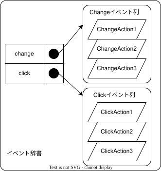

# `EventHandler` クラス

各部品の基底クラス。イベントの登録と発行を実施する。

## 使用例

```javascript
// some-cotrol.js
import { EventHandler } from './event-handler.js';
class SomeCntrol extends EventHandler {
    _value = 0;
    set value(value) {
        this._value = value;
        this.fire('change', this);
    }
    get value() {
        return this._value;
    }
}

// app.js
import { SomeControl } from 'some-control';

const someElement = new SomeControl();
someElement.on('change', (thisControl) => {
    console.log(`値が設定されました: ${thisControl.value}`);
});

// .......
someElement.value = 1;
// このタイミングで `console.log()` が呼ばれる
```

## 機能概要

- イベントの登録する
    - `on` メソッド
- イベントの発行
    - `fire` メソッド

---

## インタフェース

### `constructor()`

インスタンスを生成する

> **注意** このクラスは抽象クラスです。直接インスタンスを生成すべきではありません。

### プロパティ

なし

### メソッド

| メソッド名 | 引数                             | 概要                                 |
| ---------- | -------------------------------- | ------------------------------------ |
| `on()`     | イベント名と呼び出すCallback関数 | Callback関数をイベントとして登録する |
| `fire()`   | イベント名とイベントに対する引数 | イベントを発生させる                 |

`fire()` はイベントを発生させたいクラス、つまり **このクラス継承クラスで** 呼び出すことが想定されており、 `on()` はイベントを受け取りたいクラス、つまり **このクラスの継承クラスを呼び出すクラスで** 呼び出すことを想定している。

---

## 処理明細

### `constructor()`

- 内部で管理している イベント辞書を準備する

### `on()`

- イベント辞書から指定されたイベントが登録済みか確認する
    - 登録済みの場合:イベント列に追加する
    - 登録がなかった場合:イベント列を新たに作る

### `fire()`

- イベント辞書から指定されたイベントが登録済みか確認する
    - 登録済みの場合:イベント列の内容を順に実行していく
    - 登録がなかった場合:何もしない

---

## イベント辞書について

イベント辞書は、イベント名と実行する関数の対応付け(Map)を保存する。

`on()`メソッドでは、この辞書に登録を行います。`fire()`メソッドでは、登録されている関数を実行する。

例えば、以下のような辞書があった場合を考える。



```javascript
handler.on('change', ChangeAction4);
```

と呼び出すと、`ChangeAction4` が **Changeイベント列** に追加される。

```javascript
handler.fire('click');
```

と呼び出すと、`clickAction1`, `clickAction2`, `clickAction3`が順に呼び出される。
