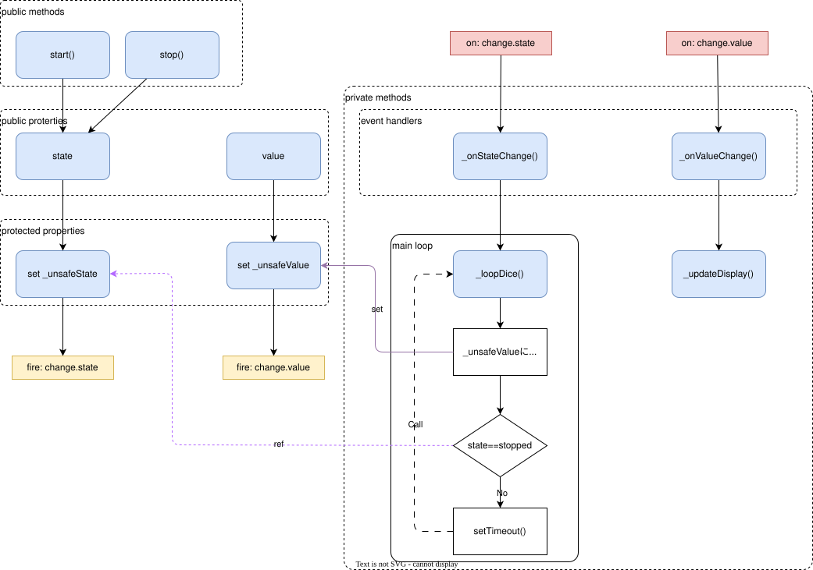

# 部品設計書: ダイス部品: `Dice`

さいころゲームのうち、ダイス一つ分を表すクラス

## 機能概要

- ダイスの目を保存する
    - `value` プロパティ
- ダイスを転がり始めさせる
    - `start` イベント
- ダイスを止める
    - `stop` イベント
- 値変更のイベント発生
    - `change` イベント
- さいころの転がり始め、停止のイベントを発生
    - `start` / `stop` イベント

---

## インタフェース

### `constructor(diceId)`

- `diceId` をダイス部品としてインスタンスを生成する。

### プロパティ

| プロパティ名 | 概要           | `set` | `get` |
| ------------ | -------------- | ----- | ----- |
| `value`      | カウンタの値   | 〇    | 〇    |
| `maximum`    | 上限値         | ×     | 〇    |
| `minimum`    | 下限値         | ×     | 〇    |
| `state`      | さいころの状態 | ×     | 〇    |
| `element`    | Dom要素        | ×     | 〇    |

- `value` は `minimum` (`1`) から `maximum` `6` の値をとるそれ以外の値が設定されると、例外が発生する

### メソッド

| メソッド名 | 引数 | 概要               |
| ---------- | ---- | ------------------ |
| `start()`  | なし | さいころを開始する |
| `stop()`   | なし | さいころを止める   |

上限や加減に達していた場合、例外が発生する

### イベント

| イベント名     | イベント           | 引数             |
| -------------- | ------------------ | ---------------- |
| `change.value` | 値が変更になった   | このオブジェクト |
| `change.state` | 状態が変更になった | このオブジェクト |

### さいころの状態

| 状態名    | 意味                   |
| --------- | ---------------------- |
| `started` | さいころが転がっている |
| `stopped` | さいころが止まっている |

状態はプロパティ `state` に保持される

---

## 処理明細

### 全体的なアーキテクチャ

### `constructor(diceId)`

- `diceId` を検索キーとしてDOM要素を検索し、クラスローカル変数に格納する。
- オブジェクトが見つからない場合は例外を発生させる。
- クラス内のイベント(`change.value` / `change.state`イベント)を登録しておく

### `value`プロパティ

#### `set`

- 型チェックと範囲チェックを行う
- `_unsafeValue`に値を設定する

#### `get`

- クラスローカルに保存している値を返却する

### `maximum` / `minimum` プロパティ

#### `set`

- **安全のため実装しない**

#### `get`

- クラスローカルに保存している最大値/最小値を返却する

### `element` プロパティ

#### `set`

- **安全のため実装しない**

#### `get`

- クラスローカルに保存しているDomエレメントを返却する

### `start()` メソッド

- `state`を `started`に設定する

### `stop()`メソッド

- `state`を `stopped`に設定する

### `_onValueChange()`イベントハンドラ

- `_updateDisplay()` メソッドを呼び出す

### `_onStateChange()` イベントハンドラ

- `state` が `started` 出会った場合、`_loopDice()`メソッドを実行する

### プライベートプロパティ

#### `_unsafeValue`

- クラス内部で値を操作する場合、型を間違うことはない。したがって、型チェックをショートカットできるプロパティを準備した
- 型チェックはしないが、値の範囲チェックは行う
- 値の設定や `change.value` イベント呼び出しをここに集約
- すでに設定されている値と同じ場合は何もしない
- クラスローカルに値を保存する
- `change.value` イベントを発生させる

#### `_unsafeState`

- クラス内部で値を操作する場合、型を間違うことはない。したがって、型チェックをショートカットできるプロパティを準備した
- 型チェックはしないが、値の範囲チェックは行う(予期した `started` または `stopped`になっているかをチェックする)
- 値の設定や `change.state` イベント呼び出しをここに集約
- すでに設定されている値と同じ場合は何もしない
- クラスローカルに値を保存する
- `change.state` イベントを発生させる

### プライベートメソッド

#### `_loopDice()` メソッド

- 現在の　`state` で動作を変える
    - `started` の場合
        - `_unsafeValue` に `getRandomValue()` で取得した乱数を設定する
        - 一定時間 (50ms) 待って、自身(`_loopDice()`)を呼び出す
    - `stopped` の場合
        - 何もせずにそのまま返却

#### `_updateDisplay()` メソッド

DOM要素のテキスト現在の値 `value` プロパティを設定する

> DOM要素の反映は機能拡張の可能性がある。したがって、`private` メソッドとして切り出している。
